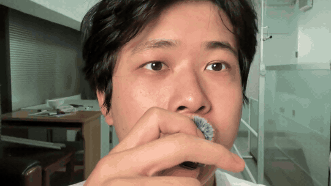
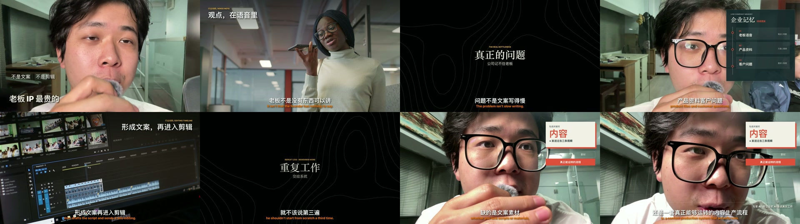
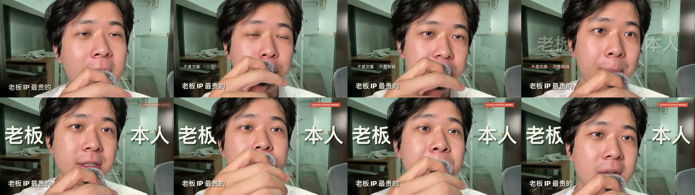
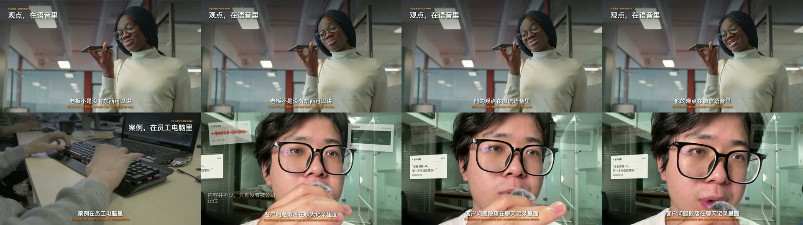
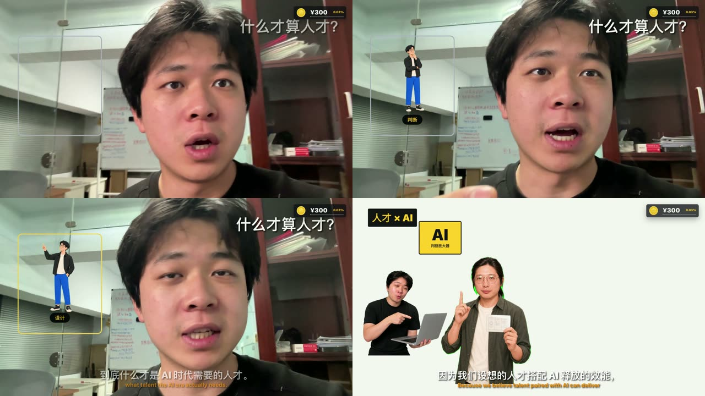
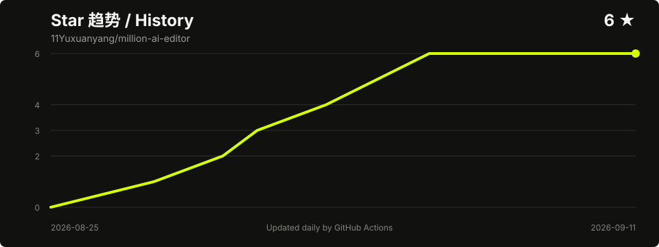

# 百万AI剪辑师 / Million AI Editor

[简体中文](README.md) | [English](README_EN.md)

> **Million AI Editor / 百万剪辑 OS**：把原始口播素材变成可审、可改、可交付的成片。

[](LICENSE)
[](pyproject.toml)
[](https://hyperframes.ai/)
[](https://github.com/11Yuxuanyang/million-ai-editor/stargazers)

**抖音账号：AI，我俩和一百万**

我们做了一个违反祖宗的决定：**开源。**

一个多月里，我们细拆了 20 多位创作者的剪辑手法，把对爆款短视频的理解放进系统，并用 10 多条真实视频持续试错。百万AI剪辑师不是“一键套模板”，而是一套让 AI 先理解内容、再作导演判断、最后完成工程化交付的剪辑系统。

它的目标很直接：让不会剪辑的人拥有一套能成长的工作流，也让专业创作者把注意力从重复劳动移回内容、判断和创造。

## 真实效果

下面的画面来自真实获批项目，不是概念稿。为保护原始素材与客户信息，仓库只保留一段经授权的短案例、低分辨率联系表、可迁移的构图判断和示例代码。

### 20 秒可播放案例

[](episodes/reference/0813-yujun-boss-content-memory/reference/case-demo-20s-720p60.mp4)

点击动态预览播放带声音的 `720p60` 案例片段。它包含口播剪切、双语字幕、真实素材、画中画与解释动画；完整母版和原始素材不进入公开仓库。

### 一条完整口播片的画面密度



同一条视觉主线贯穿片头、真实证据、解释动画、章节转场和结尾，而不是每十秒换一套模板。

### 前三秒：反常识揭示



极近人物镜头长尾拉回；惯性答案先退到视觉底层，真正结论从人物后方扩张，人物始终是主角。

### 真实证据：散落到证明



真实截图与口播词逐点对齐，先建立来源，再完成“散落 → 归档 → 调用”的视觉交接。

### VOX：生成画面只负责解释



生成素材用于比喻、解释和情绪，不冒充新闻、产品页面、聊天记录或其他真实证据。

## 它能做什么

- 理解无序上传的多段视频、静态图、录屏、文稿和补充素材。
- 转录中文口播，并用参考文稿校对内容，而不是只靠抽帧猜主题。
- 生成 cut plan，去掉首尾低头、停顿和卡壳，保留有意义的结尾动作，并统一按配置变速。
- 先写全片创意简报与完整分镜，再按连续语义段落并行制作复杂镜头。
- 组合 A-roll、全屏 B-roll、画中画、人物抠像展示字、VOX、卡片空间、Lottie 和章节转场。
- 维持固定的双语正文字幕规范，同时让片头展示字按本期内容重新设计。
- 先导出连续低清预览供人审片，批准后再输出正式母版并验证编码、色彩、声音和时长。
- 从获批成片中沉淀镜头、声音关系和审美判断；旧规则失效时允许删除，而不是无限堆积。
- 为同一期内容生成 `4:3` 与 `3:4` 封面方案。

## 工作方式

```text
原始素材 + 参考文稿
  → 媒体检查与转录
  → 内容理解 + 素材关系
  → cut plan + A-roll
  → 创意简报 + 完整分镜
  → 可选的多段并行实现
  → 总时间线、字幕和声音装配
  → 连续低清预览
  → 一次快速独立检查 + 人工审片
  → 正式母版与规格验证
```

AI 负责内容理解、素材关系、分镜和画面生成判断；`editctl.py` 负责可重复的机械步骤。主控始终拥有全片节奏、字幕、声音和装配权，避免多个 Agent 把视频剪成彼此不认识的段落。

## 五分钟开始

当前生产环境优先在 macOS 上验证。你需要：

- Python 3.11+
- [uv](https://docs.astral.sh/uv/)
- Node.js 与 npm
- FFmpeg / ffprobe
- [HyperFrames CLI](https://hyperframes.ai/)
- Codex 或能读取本地 Skill、操作文件和运行命令的兼容 Agent

```bash
git clone https://github.com/11Yuxuanyang/million-ai-editor.git 百万AI剪辑师
cd 百万AI剪辑师

uv sync --extra dev
npm install -g hyperframes@0.8.12
./system/scripts/install-local-skills.sh

python3 system/scripts/editctl.py doctor --mode runtime
```

如果使用豆包 ASR，把凭据放在本机环境或系统钥匙串，绝不要提交到仓库：

```bash
export DOUBAO_APP_KEY="..."
export DOUBAO_ACCESS_KEY="..."
python3 system/scripts/editctl.py doctor --mode full-edit --verify-asr
```

## 新建一期

```bash
python3 system/scripts/editctl.py new 0825-topic --title "本期标题" --profile general
```

把拍摄素材放进新目录的 `source/`，把参考文稿写入 `SCRIPT.md`。随后让 AI 读取项目 `AGENTS.md`、剪辑 Skill 和当期事实，先生成 `work/cut-plan.json` 与 `MOTION-STORYBOARD.md`。

常用机械命令：

```bash
python3 system/scripts/editctl.py inspect episodes/0825-topic
python3 system/scripts/editctl.py transcribe episodes/0825-topic
python3 system/scripts/editctl.py build-aroll episodes/0825-topic

# 复杂视频可拆成连续语义段落并行实现
python3 system/scripts/editctl.py pack-sequences episodes/0825-topic
python3 system/scripts/editctl.py check-sequences episodes/0825-topic
python3 system/scripts/editctl.py assemble-sequences episodes/0825-topic

python3 system/scripts/editctl.py style-check episodes/0825-topic
python3 system/scripts/editctl.py render episodes/0825-topic --quality preview
python3 system/scripts/editctl.py render episodes/0825-topic --quality master --approved
python3 system/scripts/editctl.py verify episodes/0825-topic
```

完整部署与贡献流程见 [贡献指南](docs/CONTRIBUTOR-GUIDE.md)。

## 项目结构

```text
AGENTS.md                           项目母规则与路由
config/                             稳定制作参数与单期契约
docs/EDITORIAL-MOTHER.md            导演判断与核心审美
references/SHOT-LANGUAGE.md         专业镜头语言
skills/hyperframe-video-editor/     主剪辑 Skill
skills/hyperframe-sequence-worker/  并行段落 Worker
skills/auto-cover-imagegen/         封面 Skill
library/                            审美、技巧与获批参考
references/asset-library/           可运行配方与许可素材索引
episodes/reference/                 小体积成功案例快照
system/scripts/editctl.py           统一命令行入口
system/editing/                     媒体、ASR、进程与诊断模块
```

## 设计原则

- **少规则，多判断。** 规则提供方向，不替代导演判断。
- **画面先服务理解与情绪。** 动效不是装饰，也不是为了凑“十秒一变”。
- **真实素材负责证明。** 生成画面负责解释，不能伪装成事实。
- **前三秒单独设计。** 人物、展示字、镜头运动和必要声音必须形成一个完整钩子。
- **同一期只有一条视觉主线。** 章节改变焦点与尺度，不把整片剪成 PPT 合集。
- **质量不为速度让路。** 并行、缓存和代理用来减少等待，不用来省略理解与审片。

## 现在还做不到什么

- 它不是无人值守的“上传素材立刻出爆款”按钮。好成片仍需要清楚的表达、可用素材和人的最终判断。
- 仓库不会附带你的平台账号、模型密钥、客户资料、商业字体或未经许可的音频素材。
- 公开参考展示方法，不代表可以把参考中的人物、品牌、聊天记录或像素直接挪到其他项目。
- 不同系统、拍摄规格和 HyperFrames 版本仍可能需要适配。问题和可复现样例欢迎提交到 Issues。

## 开源与素材许可

本项目原创代码与文档采用 [MIT License](LICENSE)。仓库内的案例视频、人物素材、第三方转场、Lottie、音效和外部参考仍服从各自许可证，不因本项目开源而自动变成 MIT；详情见 [THIRD_PARTY_NOTICES.md](THIRD_PARTY_NOTICES.md)。

原片、客户信息、聊天截图、平台凭据和完整正式成片默认不进入 Git。公开前请先确认你对素材拥有使用与再分发权。

## Star 趋势

[](https://github.com/11Yuxuanyang/million-ai-editor/stargazers)

图表由仓库自己的 GitHub Action 在获得新 Star 后及每天自动更新，不把访问令牌交给第三方服务。

## 参与

我们希望这套系统能继续长大，而不是被一份永不许改的规则冻住。欢迎提交：

- 真实使用中被保留的镜头方法；
- 有来源、有许可证、能解释语义作用的素材；
- 转录、切段、渲染和验证中的可复现问题；
- 能让工作流更简单、更清楚的删除和重构。

先阅读 [CONTRIBUTING.md](CONTRIBUTING.md)，再发 Issue 或 Pull Request。

## 关注与合作

抖音账号：**AI，我俩和一百万**

如需短视频制作、AI 剪辑工作流、品牌内容或项目共创合作，请扫码添加微信，备注“合作”并简单说明你的项目。

<a href="docs/assets/wechat-contact-yang-yuxuan.jpg"></a>

把注意力放回创造。百万AI剪辑师，正式开源。
